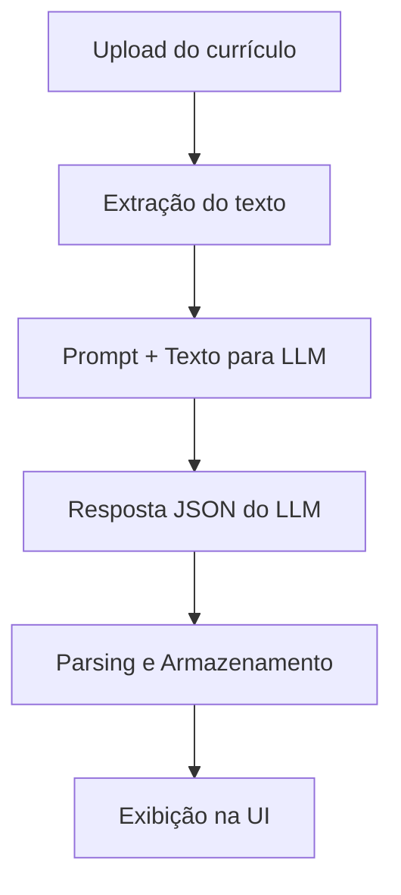

# CVOptimizer — Projeto de Avaliação Final


Aplicação web para análise e otimização de currículos (CV) desenvolvida com Streamlit, armazenamento local em SQLite e integração real com IA generativa (Groq Llama 3-70B).

> Observação: Este README foi estruturado com o auxílio de um modelo de IA.

---

# 1. Descrição do Problema e Solução Proposta

## Problema

Muitos candidatos enviam currículos genéricos para diferentes vagas e não possuem:

- Feedback estruturado por seção (resumo, experiência, habilidades, educação)
- Indicadores quantitativos da qualidade do currículo
- Comparação entre versões do mesmo currículo ou entre currículos de outros candidatos.
- Identificação clara de palavras-chave ausentes em relação a uma vaga

Ferramentas baseadas em IA que fazem esse tipo de análise existem, mas geralmente são pagas, complexas ou exigem integração com APIs externas.

---

## Solução Proposta

O **CVOptimizer** é uma aplicação web que:

- Permite upload de currículos (.pdf ou .docx)
- Armazena histórico em banco SQLite
- Gera análise estruturada por seções
- Exibe scores quantitativos por seção
- Mostra palavras-chave ausentes
- Permite comparação entre análises

Nesta versão, a análise é **realizada por IA generativa** (Groq Llama 3-70B via API Groq), sem mais uso de mocks. O sistema faz extração do texto do currículo, envia para o LLM com um prompt estruturado e armazena o resultado analisado no banco de dados.

---


## Fluxo de Integração com IA Generativa

O fluxo atual é:

1. Upload do currículo (PDF/DOCX)
2. Extração do texto do arquivo
3. Montagem do prompt (ver `prompts/system_prompt.txt`)
4. Envio do texto e prompt para o LLM (Groq Llama 3-70B)
5. Parsing do output JSON retornado pelo modelo
6. Armazenamento da análise no banco SQLite
7. Exibição dos resultados na interface

Diagrama do fluxo:



---


# 2. Escolhas de Design e Estrutura do Projeto


## Arquitetura

- **Framework Web:** Streamlit  
- **Banco de Dados:** SQLite (via `sqlite3`)
- **Modelo para desenvolvimento:** GitHub Copilot 
- **Estrutura modular e preparada para IA generativa:**
  - `app.py` — inicialização e interface principal
  - `src/` — módulos de lógica e banco de dados
  - `pages/` — páginas Streamlit
  - `mock_analysis.py` — (obsoleto, mantido apenas para referência)
  - `llm_integration.py` — integração central com modelos de linguagem (LLM)
  - `prompts/` — arquivos de prompt, incluindo `system_prompt.txt`
  - `tools/` — scripts e definições de ferramentas customizadas para o LLM

---


## Justificativas e Atualizações


### Por que Streamlit?

- Permite prototipagem rápida
- Interface e backend no mesmo arquivo (reduz complexidade)
- Ideal para MVP
- Deploy simples via Streamlit Cloud


### Por que SQLite?

- Banco leve e nativo do Python
- Não exige servidor externo
- Fácil integração
- Ideal para protótipo funcional


### Por que GitHub Copilot?

- Possui versão gratuita
- Integração direta com o VSCode
- Não exige criação de conta (possível utilizar somente com a conta do GitHub).
- Resultados satisfatórios

---


## Componentes de UI utilizados

- `st.metric()` → visualização de scores  
- `st.bar_chart()` → comparação de seções  
- `st.columns()` → layout organizado  
- `st.expander()` → exibição de detalhes  
- `st.tabs()` → navegação estruturada  

Esses componentes foram escolhidos para tornar a interface visualmente rica, mesmo sendo um protótipo.

---


## Alternativas Consideradas

- React + FastAPI → descartado por aumentar complexidade e tempo de implementação
- Gradio → menos flexível para múltiplas páginas e persistência estruturada

---


# 3. Decisões de Engenharia de LLM

## Modelo Escolhido

- **Groq Llama 3-70B** via API Groq
- Escolhido por ser um modelo de alta qualidade, com bom custo-benefício, contexto amplo, fácil integração via API REST e possui uso gratuito limitado.
- Limitações: não suporta tool calling nativo, pode retornar texto fora do formato JSON esperado, latência moderada.

## Framework e Integração

- Integração direta via requests (sem LangChain ou SDKs complexos)
- Justificativa: simplicidade, controle total do payload, menos dependências, fácil debug.

## System Prompt

O prompt principal está em `prompts/system_prompt.txt`:

```txt
# Prompt para análise completa de currículo (usado em analyze_resume_llm)
ANALYZE_RESUME_PROMPT:
Você é um assistente especialista em análise de currículos para vagas de tecnologia. Receberá o texto de um currículo e deve retornar uma análise estruturada em formato JSON, com os seguintes campos:
{
        "summary_score": (pontuação de 0 a 100 para o resumo/apresentação do candidato),
        "experience_score": (pontuação de 0 a 100 para a experiência profissional),
        "skills_score": (pontuação de 0 a 100 para habilidades técnicas),
        "education_score": (pontuação de 0 a 100 para formação acadêmica),
        "keywords_missing": [lista de 3 a 5 palavras-chave técnicas importantes que estão faltando ou pouco detalhadas no currículo]
}
Avalie cada seção de acordo com a clareza, relevância e aderência a vagas de tecnologia. Seja objetivo e não inclua comentários fora do JSON.%
```

**Decisões:**
- Persona definida: "Você é um assistente especialista em análise de currículos para vagas de tecnologia"
- Instruções claras para análise por seção
- Especificação do formato de saída (JSON)
- Restrições para evitar respostas fora do padrão
- Foram feitos testes para garantir que o modelo sempre retorne JSON válido, ajustando instruções e exemplos.

## Parâmetros do Modelo

- Temperatura: 0.2 (valores baixos tendem a garantir mais consistência no formato)
- max_tokens: 1024
- Modelo: llama-3.3-70b-versatile

## Ferramentas (Tools)

- Não foram implementadas ferramentas customizadas (tool calling) pois o modelo e o escopo não exigiam.
- Justificativa: o objetivo era análise textual, sem necessidade de funções externas.

## Estratégia de Prompting

- Uso de instruções explícitas, formato JSON
- Não foi necessário few-shot ou CoT devido à tarefa ser bem definida

## Trade-offs e Limitações

- Simplicidade da arquitetura facilita manutenção
- Limitação: se o modelo retornar texto fora do JSON, é feito parsing
- Não há RAG ou agentes, pois não agregaria valor ao caso de uso
- A ferramenta é de uso generalizado para área de tecnologia, não focando em uma vaga ou sub-área específica.
- Conteúdo adverso pode ser avaliado, mesmo que com potuação baixa.

# 4. O que Funcionou Bem

O uso do GitHub Copilot foi eficaz nas seguintes partes:

### ✔ Estrutura do Banco SQLite
- Criação das tabelas `resumes` e `analyses`
- Funções CRUD básicas
- Conexão e inicialização do banco


### ✔ Integração Real com IA Generativa
- Extração automática do texto do currículo
- Prompt estruturado e iterado
- Parsing robusto do output do LLM
- Armazenamento e exibição dos resultados reais

### ✔ Interface Streamlit
- Página de upload
- Dashboard com tabela de currículos
- Visualização com métricas
- Gráfico de barras por seção
- Estrutura inicial da página de comparação

---

## Prompts Utilizados

1.
> generate a .gitignore for a project of a cv optimizer with streamlit and sqlite

2.
> Generate a generic initial README.md in portuguese

3.
> Generate a Python module using sqlite3 for CVOptimizer.
> Create a SQLite database with tables:
> 1. resumes (id, name, email, upload_date, file_path)
> 2. analyses (id, resume_id, summary_score, experience_score, skills_score, education_score, keywords_missing, analysis_date)
> Include functions to:
> - create_tables()
> - insert_resume(name, email, file_path)
> - insert_analysis(resume_id, summary_score, experience_score, skills_score, education_score, keywords_missing)
> - get_all_resumes()
> - get_analyses_for_resume(resume_id)
> Make the code modular so it can be imported into app.py


4.
> Generate a Python module to simulate resume analysis.
> Each analysis should return a dictionary with keys:
> summary_score, experience_score, skills_score, education_score, keywords_missing
> Values should be randomized integers (0-100) for scores, and a list of 3-5 missing keywords.

5.
> Create a Streamlit page to upload a resume (PDF or DOCX) and enter basic info (name, email).
> Save the resume info to the SQLite database using database.py.
> Show a success message when uploaded.

6.
> Create a Streamlit page that lists all uploaded resumes in a table.
> Show columns: Name, Email, Upload Date
> Add a button "View Analysis" next to each resume (even if analysis is mocked)

7.
> Create a Streamlit page that shows the analysis of a selected resume.
> Display section scores using st.metric in columns.
> Show a bar chart with scores for summary, experience, skills, and education.
> Display missing keywords in an expander.
> Use the generate_mock_analysis() function from mock_analysis.py

8.
> Create a Streamlit page to compare two resume analyses.
> Display side-by-side scores for summary, experience, skills, education.
> Highlight improvements or gaps with colors.
> Show missing keywords for each resume.

9.
> Enhance the Streamlit UI:
> - Use st.tabs for navigation
> - Use st.columns for metrics
> - Use st.expander for details
> - Optionally, add st.line_chart or st.bar_chart to show trends

10.
> Vários prompts para alterar a paleta de cores das páginas.

Os prompts foram utilizados de forma incremental, com revisão e ajustes manuais após cada geração. Para a criação destes prompts foi utilizada uma ferramenta da IA para auxiliar na adequação.

* Para esta segunda fase do trabalho houve uma maior necessidade de correção nos resultados apresentados pelo Copilot. Houve a necessidade de muitos prompts solicitando correções e adaptações ao que havia sido implementado. Em alguns casos, foi necessário correção manual. Desta forma, não serão apresentados aqui todos os prompts utilizados nesta etapa do trabalho. 

---


# 5. O que Não Funcionou / Limitações

Algumas limitações e ajustes necessários:

- Ajustes visuais para melhorar organização da UI
- Tabela da aba "Lista currículo", foi gerada pelo Copilot com o cabeçalho no final e uma por linha.
- Na ausência de dados no banco as abas contidas no diretório pages "quebram".


Além disso:

- O modelo ocasionalmente retorna texto fora do JSON esperado (mitigado com parsing)
- Não há autenticação do usuário
- Não há RAG, agentes ou tool calling avançado
- Foram necessárias várias iterações no prompt para garantir robustez e corrigir pequenos erros e inconsistências.

---


# 6. Uso Efetivo do Agente de Codificação

O projeto foi desenvolvido majoritariamente com auxílio do GitHub Copilot.

Estratégia utilizada:

1. Criar arquivo base
2. Auxílio de ferramente externa (chat gpt) para a criação dos prompts para o Copilot.
3. Permitir geração automática de código
4. Revisar manualmente
5. Ajustar e refatorar
6. Commit incremental

A estrutura inicial foi gerada por IA, com supervisão humana para validação e ajustes.

Este README também foi estruturado com auxílio de modelo de IA.

---

# Execução

O projeto pode ser executado localmente, digitando o comando abaixo no diretório do projeto:

```bash
streamlit run app.py
```

A aplicação, atualmente, também pode ser executada por meio do link:

https://cvoptimizer-iagenerativa-aeypxfwpdwtmmftazjefvt.streamlit.app


---


# Requisitos

- Python 3.8+ (recomendado 3.12+)  
- streamlit  
- sqlite3 (nativo do Python)
- PyPDF2
- docx2txt
- requests

---


# Conclusão

O CVOptimizer demonstra:

- Estrutura completa de aplicação web
- Persistência de dados
- Interface interativa
- Integração real e robusta com IA generativa
- Decisões de engenharia de LLM documentadas e justificadas
- Uso extensivo e documentado de agente de codificação